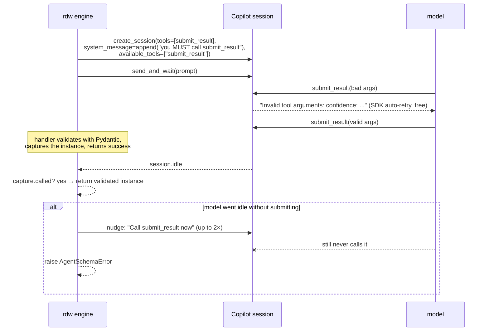
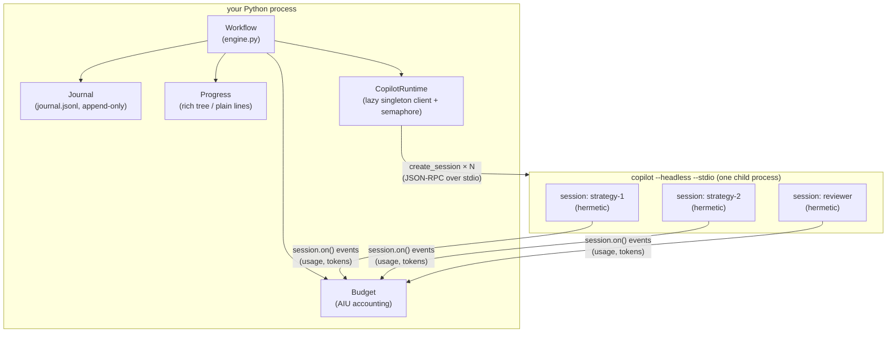

# Rapp Dynamic Workflows

Dynamic multi-agent workflow orchestration for AI coding harnesses — with the
[GitHub Copilot SDK](https://github.com/github/copilot-sdk) as the hero use case.

The core (`agent` / `parallel` / `pipeline` / `phase`, schemas, budgets,
journaled resume) is harness-neutral: any backend that can run a prompt in an
isolated session can plug in via the `BaseRuntime` protocol. Copilot ships
first because it has programmatic sessions, custom tools, and usage events but
no orchestration layer of its own; see the [roadmap](#roadmap) for what's next.

Write plain async Python that fans out hermetic Copilot agent sessions, forces
schema-validated structured output, streams items through pipelines, enforces a
hard AI-credit budget, and journals every call so an interrupted run **resumes
instead of respawning**.

```python
# wave.py
from pydantic import BaseModel

class Idea(BaseModel):
    approach: str
    confidence: float

async def workflow(wf):
    async with wf.phase("design"):
        ideas = await wf.parallel([
            (lambda i=i: wf.agent(
                f"You are strategist {i} of 4. Propose a design for offline sync.",
                schema=Idea, label=f"strategy-{i}"))
            for i in range(1, 5)
        ])
    wf.log(f"{sum(x is not None for x in ideas)} ideas survived")
```

```console
$ pip install rapp-dynamic-workflows   # prereq: `copilot` CLI is installed and logged in
$ rdw run wave.py --budget 50
```

**Attribution, honestly:** this library is directly inspired by Claude Code's
Workflow tool (`agent` / `parallel` / `pipeline` / `phase`, failures-resolve-to-None,
journaled resume, quality patterns like adversarial verification and judge
panels). It reimplements that vocabulary on the GitHub Copilot SDK, which has
programmatic sessions, custom tools, and usage events — but no orchestration
layer of its own ([copilot-sdk#301](https://github.com/github/copilot-sdk/issues/301)
is still open). Where exact parity is impossible (Python cannot sandbox
determinism the way Claude's JS journal does; the SDK has no native
`response_format`), the gap is documented rather than papered over. See
[Non-parity notes](#non-parity-with-claude-codes-workflow-tool).

---

## 60-second quickstart

1. **Prereqs.** Python 3.11+, the `copilot` CLI installed and logged in (the SDK
   spawns it and inherits your auth — no API keys).

2. **Install.**

   ```console
   $ pip install rapp-dynamic-workflows
   ```

3. **Write a workflow script.** A script is ordinary async Python exposing
   `async def workflow(wf)`:

   ```python
   # review.py
   from pydantic import BaseModel

   class Verdict(BaseModel):
       approve: bool
       summary: str

   async def workflow(wf):
       async with wf.phase("review"):
           v = await wf.agent(
               "Review the diff HEAD~1..HEAD strictly for correctness.",
               schema=Verdict, label="reviewer", effort="high")
       wf.log(f"approve={v.approve}: {v.summary}")
   ```

4. **Run it.**

   ```console
   $ rdw run review.py --budget 20 --model gpt-5.6-terra
   ```

   Progress renders as a live tree (rich + TTY) or plain grep-able lines (CI).
   Every agent call is journaled under `.rdw/runs/<run-id>/`.

5. **Interrupt and resume.** Ctrl-C prints the resume command. Re-running with
   `--resume` serves completed agents from the journal instantly — no sessions,
   no credits — and goes live at the first call that changed:

   ```console
   $ rdw run review.py --resume 20260721-104500-a1b2c3
   ```

You can also skip the CLI entirely and drive a workflow from your own program:

```python
import asyncio
from rdw import Workflow

async def main():
    async with Workflow.open(budget=50.0) as wf:
        text = await wf.agent("Summarize CONTRIBUTING.md in 3 bullets.")
        print(text)
        print(wf.report())

asyncio.run(main())
```

---

## API reference

Everything below is importable from `rdw`. The module-level functions
(`agent`, `parallel`, `pipeline`, `phase`, `log`) delegate to the `Workflow`
bound to the current async context, so inside a `rdw run` script
`from rdw import agent` and `wf.agent` are interchangeable.

| API | Signature | Semantics |
|---|---|---|
| `agent` | `await wf.agent(prompt, *, schema=None, label=None, phase=None, model=None, effort=None, timeout=600.0, tools=None, cwd=None)` | Run **one hermetic session** and return its result. With `schema` (a Pydantic model class or raw JSON-schema dict): returns the validated instance/dict the model passed to the forced `submit_result` tool. Without: returns the final assistant message text. Raises `BudgetExceeded` (refused at admission), `AgentTimeout` (session aborted first), `AgentSchemaError` (model never submitted), `AgentError` (session error). |
| `parallel` | `await wf.parallel(thunks)` | Barrier over branches. Each thunk is a zero-arg callable returning an awaitable (or an awaitable directly). A failing branch resolves to **`None`** — `parallel` itself never raises for `Exception`-derived failures, including `BudgetExceeded`, so a capped wave degrades instead of crashing. Results keep input order. Concurrency is capped by the workflow-wide semaphore (`--concurrency`, default `min(16, cpu-2)`). |
| `pipeline` | `await wf.pipeline(items, *stages)` | Flow each item through the stages with **no barrier between stages** — item 3 can be in stage 1 while item 1 is in stage 3. A stage exception, or a stage returning `None`, drops that item to `None` and skips its remaining stages. Results keep input order. |
| `phase` | `with wf.phase(title):` or `async with wf.phase(title):` | Scopes journal grouping and progress display. Propagates through the async context, so agents spawned concurrently inside a phase inherit it. |
| `log` | `wf.log(msg)` | Progress line plus a non-replayable journal note. |
| `budget` | `wf.budget` → `Budget(total=None)` | `spent()`, `remaining()`, `session_spent(session_id)`, `summary()`. Hard ceiling in AI credits; see [Budget semantics](#budget-semantics). |
| `Workflow.open` | `Workflow.open(*, run_id=None, root=".rdw", resume=False, budget=None, runtime=None, progress=None, model=None, effort=None, cwd=None, concurrency=None)` | Batteries-included constructor: creates `.rdw/runs/<run-id>/`, the journal, budget, progress, and a shared-client `CopilotRuntime`. Use `async with`. |
| `wf.report()` | → `str` | Run summary: total spend vs ceiling, cache hits, divergence flag, and a per-agent table (status, AIU, wall time). |
| `current_workflow()` | → `Workflow` | The ambient workflow (raises `WorkflowContextError` outside one). |

Quality patterns (plain functions, `from rdw import ...` or `from rdw.patterns import ...`):

| Pattern | Signature | Returns |
|---|---|---|
| `adversarial_verify` | `await adversarial_verify(claim, n=3, *, evidence=None, wf=None, model=None, effort=None)` | `VerifyResult(passed, upheld, rejected, votes)` — truthy iff a strict majority of responding skeptics upheld the claim. |
| `judge_panel` | `await judge_panel(candidates, lenses, *, wf=None, model=None, effort=None)` | `list[RankedCandidate]` best-first; one judge per lens scores every candidate 0–10, final score is the mean across responding lenses. |
| `loop_until_dry` | `await loop_until_dry(finder, key, dry_rounds=2, *, max_rounds=10, wf=None)` | All unique findings in first-seen order; stops after `dry_rounds` consecutive rounds with nothing new. |

Errors (`from rdw import ...`): `RdwError` (base), `AgentError`, `AgentTimeout`,
`AgentSchemaError`, `BudgetExceeded` (`.spent`, `.total`), `JournalError`,
`WorkflowContextError`, and the `DivergenceWarning` / `JournalWarning` warning
categories.

CLI:

| Command | Does |
|---|---|
| `rdw run script.py [--resume RUN_ID] [--budget N] [--model M] [--effort low\|medium\|high\|xhigh] [--cwd DIR] [--concurrency N] [--root DIR]` | Execute the script's `async def workflow(wf)` inside a run. |
| `rdw runs [--root DIR]` | List recorded runs (newest first) with agent counts and AIU spend. |
| `rdw show <run-id> [-v] [--root DIR]` | Dump a run's journal in readable form (`-v` includes results/errors). |

`--root` is accepted both before the subcommand (`rdw --root DIR run …`) and
after it (`rdw run … --root DIR`); when given in both places the
post-subcommand value wins.

---

## How schema forcing works (no native `response_format`)

The Copilot SDK has **no** API-level structured output — grep-confirmed against
the installed source. `rdw` builds it from three real SDK primitives plus one
engine-level guard:



The pieces:

1. **A forced tool.** Your Pydantic model (or raw JSON-schema dict) is compiled
   into a custom `submit_result` tool whose `parameters` are the model's
   generated JSON schema. The handler validates with `model_validate` and
   captures the instance.
2. **Free validation retries.** On `ValidationError` the handler returns the
   SDK-shaped `"Invalid tool arguments: ..."` failure — the same mechanism the
   SDK's own `define_tool` uses — so the model sees exactly which fields were
   wrong and retries in-band, at no orchestration cost.
3. **Tool-choice pressure.** When you pass `schema` and no extra `tools`, the
   session's `available_tools` allowlist is narrowed to just `submit_result`:
   a pure-extraction agent has literally nothing else to reach for.
4. **The nudge ladder.** If the session goes idle without submitting, the
   engine re-prompts up to 2 times ("Call `submit_result` now..."), then raises
   `AgentSchemaError` — which `parallel()` converts to `None`.

**Honest limit:** this is a strong convention plus bounded retries, not
decoder-level constrained sampling. A pathological model can stonewall through
the ladder; the contract is "validated instance or a typed failure", and the
failure rate is model-dependent rather than zero.

---

## Quality-pattern cookbook

All patterns are thin combinators over `agent` + `parallel` — budgets,
journaling, resume, and None-on-failure apply automatically.

### Adversarial verify

N independent skeptics, each explicitly told to *destroy* the claim from a
different angle (counterexamples, hidden assumptions, real-world failure modes,
internal contradictions, contradicting evidence). Passes on a strict majority
of respondents.

```python
from rdw.patterns import adversarial_verify

async def workflow(wf):
    plan = await wf.agent("Design a zero-infra signaling layer.", label="designer")
    result = await adversarial_verify(
        "This signaling design needs no server-side resources at runtime.",
        n=5, evidence=plan, model="gpt-5.6-terra",
    )
    if not result:                      # VerifyResult is truthy on pass
        wf.log(f"claim rejected {result.rejected}-{result.upheld}; revisiting")
        for vote in result.votes:
            wf.log(f"  skeptic: holds={vote.claim_holds} — {vote.reasoning[:100]}")
```

### Judge panel

One judge per *lens*, each scoring every candidate 0–10 through that lens alone;
a candidate's final score is its mean across the lenses whose judge responded.

```python
from rdw.patterns import judge_panel

ranked = await judge_panel(
    candidates=[s for s in strategies if s is not None],
    lenses=["robustness", "zero-infra cost", "implementation risk"],
    model="gpt-5.6-terra",
)
winner = ranked[0]
wf.log(f"winner: candidate {winner.index} at {winner.score:.1f} ({winner.by_lens})")
```

### Loop until dry

Review-until-clean: repeat a finder (which may also fix the previous round's
findings) until `dry_rounds` consecutive rounds surface nothing new.

```python
from pydantic import BaseModel
from rdw.patterns import loop_until_dry

class Finding(BaseModel):
    file: str
    line: int
    summary: str

class Report(BaseModel):
    findings: list[Finding]

async def find_and_fix(round_no: int):
    report = await wf.agent(
        f"Round {round_no + 1}: review src/ for defects; fix any you already "
        "reported last round, then report what remains.",
        schema=Report, label=f"reviewer-{round_no + 1}")
    return report.findings if report else []

all_findings = await loop_until_dry(
    find_and_fix,
    key=lambda f: (f.file, f.line, f.summary),   # stable identity for dedup
    dry_rounds=2,                                # one clean pass can be luck
)
```

### Multi-model sweep

Same prompt across the model tiers, then a judge panel to pick. `parallel`
absorbs any branch failure into `None`, so one model erroring never kills the
sweep.

```python
MODELS = ["gpt-5.6-sol", "gpt-5.6-terra", "gpt-5.6-luna"]

drafts = await wf.parallel([
    (lambda m=m: wf.agent(
        "Write the migration plan for the v2 schema.",
        schema=Plan, model=m, label=f"draft-{m}"))
    for m in MODELS
])
candidates = [d for d in drafts if d is not None]
ranked = await judge_panel(candidates, lenses=["correctness", "risk", "clarity"])
```

---

## Journal & resume semantics

Every `agent()` call gets a **fingerprint** — `sha256(prompt, normalized opts)`
where opts are only the result-affecting options (schema hash, model, effort,
tool names, cwd) — plus an **occurrence number** (the Nth call with that exact
fingerprint in the run). `label` and `timeout` are deliberately excluded, so
renaming an agent or tweaking its timeout never busts the cache. Records append
to `.rdw/runs/<run-id>/journal.jsonl` as they complete — a crash mid-wave keeps
every finished branch (each append is fsynced, and a torn final line from a
crash mid-append is skipped with a `JournalWarning` on the next resume instead
of breaking it).

Replay identity is **content-addressed, not positional**, on purpose: under
`parallel()` and `pipeline()` the order agents *start* depends on live session
latency and differs run to run, so a call-order position would spuriously
diverge an identical resumed run. Keyed by `(fingerprint, occurrence)`, an
identical resume replays 100% from the journal no matter how the event loop
interleaved the original — which is sound because agents are hermetic functions
of (prompt, opts).

On `--resume`, the contract is:

| Journal state for this call's `(fingerprint, occurrence)` | Behavior |
|---|---|
| `ok` record | **Replay** the cached result instantly — no session, no credits, re-validated against the schema on load. |
| `error` record | Re-execute live (it's a retry, not a divergence). |
| No record, while unreplayed cached records remain | The run has **diverged**: a `DivergenceWarning` is emitted (loudly, once), a divergence marker is appended, and everything from this call on runs live. |
| No record, cache fully consumed | New work appended to the script — runs live, no divergence. |

The file is genuinely append-only: superseding is event-sourced (a later line
for the same key wins), so the on-disk history of every generation of the run
is preserved and a resume *after* a divergence replays the new tail correctly.

**Honest limit:** replay identity is by fingerprint convention, not enforced
determinism. Claude's Workflow tool makes `Date.now()` throw inside a workflow;
Python can't sandbox itself. If your script builds prompts from wall-clock or
randomness, fingerprints shift and you'll get a (loud) divergence rather than
silent corruption.

---

## Budget semantics

Budgets are denominated in **AI credits (AIU)** — the unit Copilot itself bills
sessions in. Spend is read from two session-event channels, verified against the
installed SDK's generated event types:

- `assistant.usage` — per model call; `data.copilot_usage.total_nano_aiu` is
  that call's cost in nano-AIU (1 AIU = 10⁹ nano-AIU).
- `session.usage_checkpoint` — `data.total_nano_aiu` is the session's
  *cumulative* spend, emitted at idle.

A session's spend is `max(latest checkpoint, sum of per-call deltas)` — robust
to either channel lagging, never double-counting. Enforcement is two-tier:

1. **Admission control with reservations (always):** before every live agent
   start, the engine reserves a grant from the *uncommitted* remainder —
   ceiling minus reported spend minus every grant still held by an in-flight
   session — and raises `BudgetExceeded` when that remainder is gone. A wave
   arriving near the ceiling is therefore refused even before any usage event
   lands, not blindly admitted. Journal-replayed results bypass the gate —
   they cost nothing. Inside `parallel()`, `BudgetExceeded` branches resolve
   to `None`, so a wave that hits the ceiling mid-flight degrades instead of
   crashing.
2. **Defense in depth (when a ceiling is set):** each admitted session is
   created with `session_limits={"max_ai_credits": grant}` where the grant is
   **half the uncommitted remainder** at admission. Concurrent grants shrink
   geometrically (½, ¼, ⅛ … of remaining), so the caps handed to any number of
   simultaneous sessions always sum to less than the remaining budget — the
   worst case is bounded by `total`, never `total + N × remaining`. The SDK
   marks `session_limits` Experimental; admission control does not depend on
   it.

**Honest limit:** usage events arrive *after* a model step completes, so one
in-flight step can overshoot its grant before the gate sees it. Hard real-time
cost guarantees are impossible at this layer. And because a single session is
capped at half the remainder, one agent that legitimately needs more than that
will be cut off by its session limit — split the work or raise the budget.

---

## Architecture

One Python process (your script) orchestrates; one shared `CopilotClient`
multiplexes every agent session over a single spawned
`copilot --headless --stdio` child. The orchestrator itself spends **zero
tokens** — control flow is plain Python, never a model deciding what to run
next.



Each `agent()` call is one fresh `create_session` with an isolated system
prompt (`skip_custom_instructions=True`), its own model/effort/cwd, its own
credit cap, and — for schema agents — a narrowed tool catalog. Sessions share
no ambient state, which is what makes fingerprinted replay meaningful. The
client (and its child process) starts lazily on the first live session, so a
fully-cached resume never spawns anything, and is stopped exactly once when the
workflow exits.

Deep dive: [docs/architecture.md](docs/architecture.md).

---

## FAQ

**How do I control cost?**
Four dials, from coarse to fine: `--budget N` (hard run ceiling, admission-gated
per agent, mirrored into each session's `session_limits`), `--concurrency`
(fewer simultaneous sessions), per-agent `model=` / `effort=` (route extraction
to cheap tiers, reserve frontier models for implementers), and `timeout=`
(a timed-out session is `abort()`ed before the error is raised, so it stops
spending immediately). `wf.report()` and `rdw runs` show where the credits
went.

**Does it work with BYOK models?**
Yes. The SDK's `create_session` accepts `provider=` / `providers=` / `models=`
kwargs for Azure, OpenAI, Anthropic, or custom endpoints (verified against the
installed SDK source). `rdw` doesn't surface these on `agent()` yet; the
supported route is a small `CopilotRuntime` subclass that injects them into
every session:

```python
from rdw import CopilotRuntime, Workflow

class ByokRuntime(CopilotRuntime):
    async def create_session(self, **kwargs):
        kwargs.setdefault("providers", [MY_NAMED_PROVIDER])
        kwargs.setdefault("models", [MY_BYOK_MODEL])
        return await super().create_session(**kwargs)

wf = Workflow.open(runtime=ByokRuntime(), model="my-byok-model-id")
```

**How does this relate to Copilot custom agents / skills?**
They're complementary layers. Custom agents (`.agent.md`) and skills configure
what *one* session can do; the SDK's `task` tool lets a model delegate to
subagents *it* chooses. `rdw` is the layer above both: deterministic Python
deciding which sessions run, in what order, with what schema and budget —
control flow the model never gets to improvise. `rdw` agents are deliberately
hermetic (custom instructions skipped), but you can hand any agent extra SDK
`Tool` objects via `tools=`.

**Why not just loop `copilot -p` in a shell script?**

| | `copilot -p` loops | rapp-dynamic-workflows |
|---|---|---|
| Process model | One CLI process per prompt (node startup each time) | One shared runtime; sessions are cheap |
| Concurrency | DIY (`&`, `xargs -P`), no shared cap | Semaphore-capped `parallel` / `pipeline` |
| Structured output | Parse stdout and pray | Schema-forced `submit_result` + free validation retries + typed failure |
| Partial failure | One bad exit poisons the pipeline | Failed branch → `None`, wave survives |
| Budget | `--max-ai-credits` per process, no run total | Run-wide ceiling + per-session caps + per-agent attribution |
| Resume | Re-run everything | Journal replay; only divergent calls re-execute |
| Timeouts | `timeout(1)` kills the process, turn keeps billing server-side | `session.abort()` then typed `AgentTimeout` |
| Observability | Grep JSONL | Live tree, `rdw runs` / `rdw show`, `wf.report()` |

**Where does state live?**
`.rdw/runs/<run-id>/` — `journal.jsonl` (append-only call log and replay
cache) and `meta.json` (script path, budget, model). Delete a run directory to
forget it; nothing else is written.

---

## Non-parity with Claude Code's Workflow tool

Full parity where it's implementable; documented gaps where it isn't:

| Claude Workflow tool | rdw equivalent | Gap |
|---|---|---|
| `agent(prompt, {schema, label, phase, model})` | `wf.agent(...)` — same shape | Schema forcing is convention + retries, not constrained decoding |
| `parallel()` → failures resolve to `null` | `wf.parallel()` → `None` | None |
| `pipeline()` — no inter-stage barrier | `wf.pipeline(items, *stages)` | None |
| Enforced determinism (`Date.now` throws) | Fingerprint divergence detection (loud warning, live-from-divergence) | Determinism is by convention; divergence is detected, not prevented |
| Token budget | AI-credit budget (admission gate + experimental `session_limits`) | One in-flight step can overshoot before events land |
| Zero-token orchestrator | Zero-token orchestrator (plain Python) | None |

---

## Roadmap

Copilot is the hero use case, not the boundary. The orchestration core never
imports the Copilot SDK directly — every live call goes through the
`Runtime`/`SessionHandle` protocols (`rdw/runtime.py`), and `CopilotRuntime` is
just the first implementation (the test suite's `FakeRuntime` is technically
the second). Planned, in rough order:

1. **Runtime adapter guide** — document the `BaseRuntime` contract
   (`create_session` → `SessionHandle` with `send_and_wait` / `on` / `abort` /
   `disconnect`) so third parties can ship adapters without reading source.
2. **Claude Code / Claude Agent SDK runtime** — same workflow scripts, agents
   backed by Claude sessions; budget maps to output tokens instead of AI credits.
3. **Generic headless-CLI runtime** — anything that can run
   `<tool> -p "<prompt>"` in a subprocess (Codex-style CLIs, local models via
   an OpenAI-compatible server) with schema forcing via the submit-tool
   convention or grammar-constrained sampling where available.
4. **Mixed-runtime workflows** — different `runtime=` per `agent()` call in one
   journaled run: draft on a cheap local model, verify on a frontier one.
5. **Live progress web view** — the journal is already an event log; render it.

If you build an adapter, open a PR — the contract test suite in
`tests/conftest.py` is the compliance kit.

---

## Development

Tests never run live inference — the whole suite drives a fake runtime
(subclass of `rdw.BaseRuntime`); live smoke examples are gated behind
`RDW_LIVE=1`. See [CONTRIBUTING.md](CONTRIBUTING.md).

## License

MIT © 2026 Kody Wildflower. Not affiliated with GitHub or Anthropic;
"Copilot" is a trademark of GitHub. Inspired by Claude Code's Workflow tool.
